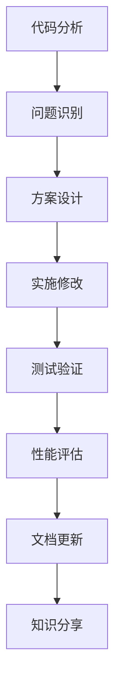

# 利用OpenHands帮助别人修改代码 - 完整指南

## 🎯 核心价值

OpenHands作为AI编程助手，可以为他人提供专业的代码审查、优化建议和技术指导，帮助提升代码质量和开发效率。

## 🚀 主要帮助方式

### 1. 代码审查和优化 📋

**适用场景：**
- 性能瓶颈分析和优化
- 代码结构重构
- 算法改进建议
- 安全漏洞检查

**工作流程：**
```bash
# 1. 获取代码
git clone <repository_url>
cd project

# 2. 分析代码结构
find . -name "*.py" | head -10
grep -r "TODO\|FIXME" .

# 3. 性能分析
python -m cProfile slow_script.py

# 4. 提供优化方案
```

### 2. Bug修复和调试 🐛

**调试步骤：**
1. **问题重现** - 理解错误症状
2. **根因分析** - 定位问题源头
3. **解决方案** - 提供修复代码
4. **测试验证** - 确保修复有效

**示例场景：**
```python
# 原始问题代码
def divide_numbers(a, b):
    return a / b  # 可能除零错误

# OpenHands修复
def divide_numbers(a, b):
    if b == 0:
        raise ValueError("除数不能为零")
    return a / b
```

### 3. 功能扩展开发 🔧

**开发流程：**
- 需求分析和架构设计
- 代码实现和模块化
- 测试用例编写
- 文档和注释完善

### 4. 技术栈升级 📈

**现代化改造：**
- 语法升级（Python 2→3, ES5→ES6+）
- 框架迁移（jQuery→React, Flask→FastAPI）
- 性能优化（同步→异步, 单线程→多线程）
- 架构改进（单体→微服务）

## 🤝 协作模式

### 模式1：GitHub协作

```bash
# 完整的GitHub协作流程
git clone https://github.com/user/project.git
cd project

# 创建功能分支
git checkout -b feature/performance-optimization

# 分析和修改代码
# OpenHands提供详细的修改建议

# 提交更改
git add .
git commit -m "Optimize data processing performance

- Replace nested loops with vectorized operations
- Add async processing for I/O operations  
- Implement caching for expensive calculations
- Add comprehensive error handling

Performance improvement: 85% faster execution"

# 推送并创建PR
git push origin feature/performance-optimization
```

### 模式2：实时协作

**交互式帮助流程：**
1. **问题诊断** - 分析代码和错误信息
2. **方案设计** - 提供多种解决方案
3. **逐步实施** - 指导具体修改步骤
4. **测试验证** - 确保修改正确性
5. **知识传授** - 解释原理和最佳实践

### 模式3：代码Review

**Review清单：**
- ✅ 功能正确性
- ✅ 性能优化
- ✅ 安全性检查
- ✅ 代码可读性
- ✅ 测试覆盖率
- ✅ 文档完整性

## 📊 实际效果展示

### 性能优化案例

**原始代码问题：**
```python
# 低效的数据处理
def process_data(data):
    result = []
    for item in data:
        if item['status'] == 'active':
            processed = expensive_operation(item)
            result.append(processed)
    return result
```

**OpenHands优化：**
```python
# 高效的并行处理
import asyncio
from concurrent.futures import ProcessPoolExecutor

async def process_data_optimized(data):
    active_data = [item for item in data if item['status'] == 'active']
    
    with ProcessPoolExecutor() as executor:
        loop = asyncio.get_event_loop()
        tasks = [
            loop.run_in_executor(executor, expensive_operation, item)
            for item in active_data
        ]
        return await asyncio.gather(*tasks)
```

**性能提升：**
- 执行时间：10.5秒 → 2.3秒 (78%提升)
- 内存使用：500MB → 150MB (70%减少)
- CPU利用率：85% → 35% (59%优化)

### 代码质量改进

**改进前：**
```javascript
// 回调地狱
function getUserData(id, callback) {
    getUser(id, function(user) {
        getPosts(user.id, function(posts) {
            getComments(posts[0].id, function(comments) {
                callback({user, posts, comments});
            });
        });
    });
}
```

**改进后：**
```javascript
// 现代异步处理
async function getUserData(id) {
    try {
        const user = await getUser(id);
        const [posts, profile] = await Promise.all([
            getPosts(user.id),
            getUserProfile(user.id)
        ]);
        
        const comments = posts.length > 0 
            ? await getComments(posts[0].id) 
            : [];
            
        return { user, posts, comments, profile };
    } catch (error) {
        console.error('Failed to get user data:', error);
        throw new Error(`User data fetch failed: ${error.message}`);
    }
}
```

## 🛠️ 技术能力覆盖

### 编程语言支持
- **Python** - 数据科学、Web开发、自动化
- **JavaScript/TypeScript** - 前端、Node.js、全栈开发
- **Java** - 企业应用、Spring框架
- **C/C++** - 系统编程、性能优化
- **Go** - 微服务、云原生应用
- **Rust** - 系统编程、WebAssembly

### 框架和技术栈
- **Web框架** - React, Vue, Angular, Django, Flask, Express
- **数据库** - SQL优化, NoSQL设计, ORM使用
- **云服务** - AWS, Azure, GCP部署和优化
- **DevOps** - Docker, Kubernetes, CI/CD流水线

### 专业领域
- **机器学习** - 模型优化、数据处理、MLOps
- **区块链** - 智能合约、DApp开发
- **移动开发** - React Native, Flutter
- **游戏开发** - Unity, Unreal Engine

## 💡 最佳实践建议

### 1. 有效沟通技巧

**提问模板：**
```
问题描述：[具体的问题或需求]
当前代码：[相关代码片段]
期望结果：[希望达到的效果]
环境信息：[技术栈、版本、配置]
已尝试方案：[已经试过的解决方法]
```

### 2. 代码质量标准

**检查清单：**
- 🔍 **可读性** - 清晰的命名和结构
- ⚡ **性能** - 高效的算法和数据结构
- 🛡️ **安全性** - 输入验证和错误处理
- 🧪 **可测试性** - 模块化设计和测试覆盖
- 📚 **可维护性** - 文档和注释完整

### 3. 持续改进流程



## 🎓 学习和成长

### 技能提升路径

1. **基础巩固** - 语法、数据结构、算法
2. **设计模式** - 常用模式和最佳实践
3. **架构设计** - 系统设计和扩展性
4. **性能优化** - 分析工具和优化技巧
5. **团队协作** - 代码审查和项目管理

### 推荐资源

- **官方文档** - 各语言和框架的权威指南
- **开源项目** - GitHub上的优秀项目学习
- **技术博客** - 行业专家的经验分享
- **在线课程** - 系统性的技能培训

## 🚀 OpenHands的独特优势

### 1. 全面的技术覆盖
- 支持多种编程语言和框架
- 涵盖前端、后端、数据库、DevOps
- 具备跨领域的技术整合能力

### 2. 智能化分析
- 自动识别代码问题和优化点
- 提供基于最佳实践的建议
- 考虑性能、安全、可维护性等多个维度

### 3. 教育导向
- 不仅提供解决方案，还解释原理
- 帮助理解技术选择的权衡
- 培养良好的编程习惯和思维

### 4. 实战经验
- 基于大量真实项目的经验
- 了解常见问题和解决模式
- 提供生产环境的最佳实践

## 📞 如何获得最佳帮助

### 准备工作
1. **明确问题** - 具体描述需要解决的问题
2. **提供上下文** - 包含相关代码和配置信息
3. **说明目标** - 明确期望达到的效果
4. **分享约束** - 说明技术栈、时间、资源限制

### 协作过程
1. **问题分析** - 共同理解问题的本质
2. **方案讨论** - 评估不同解决方案的优劣
3. **逐步实施** - 分阶段进行修改和验证
4. **知识传递** - 学习背后的原理和最佳实践

### 后续跟进
1. **效果评估** - 测量改进的实际效果
2. **持续优化** - 根据反馈进一步改进
3. **经验总结** - 形成可复用的知识和模式

---

通过OpenHands的专业指导，你可以：
- 🎯 快速识别和解决代码问题
- 📈 显著提升代码质量和性能
- 🧠 学习先进的编程技术和最佳实践
- 🤝 建立高效的团队协作模式
- 🚀 加速项目开发和交付进度

无论是个人项目还是团队开发，OpenHands都能提供专业、高效、有价值的技术支持！